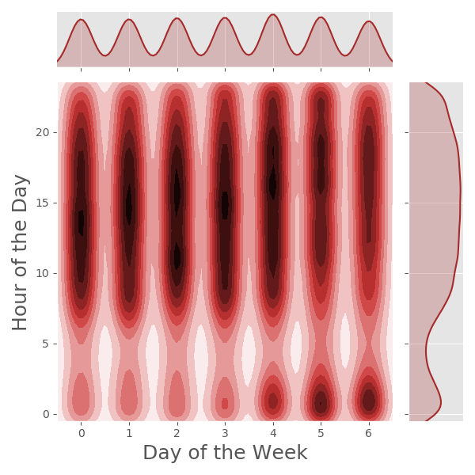

# Boulder Fire Department - Incident Response 2015-2018

## Table of Contents

1. [Overview](#overview)
2. [Data](#data)
3. [First Glance](#first-glance)
4. [When are incidents occurring?](#when-are-incidents-occurring?)
5. [What now?](#what-now?)

## Overview

Fire departments respond around the clock to a variety of incidents. This EDA primarily sought to quantify the the type of incidents the Boulder Fire Department (BFD) commonly respond to. This study also looked into the location of incidents, as well as investigated the timing of incidents over many different intervals to attempt to infer some information about when, where, and what the BFD are responding to.

## Data

The data was obtained directly from the Boulder government site [here](https://bouldercolorado.gov/open-data/boulder-fire-response-times/). The data was generally in good condition, consisting largely of information regarding incident location (latitude, longitude), multiple measures of response time, as well as general information regarding what the BFD was responding too. There were multiple columns with as many NaNs or zeros as actual data

For this study, data concerning ambulance responses, data from 2019, as well as any rows of information not containing latitude and longitude data for the sight of the incident, were not investigated.

## First Glance

Over the course of the four years investigated, the BFD responded to nearly 51.5 thousand incidents, which broke down nearly equally by year.

 

Of those incidents, the vast majority were responses to Emergency Medical Service (EMS) calls.

 

## When are incidents occurring?

I was curious to see when the BFD receives the highest volume of calls over the course of the week. I anticipated seeing a higher concentration of calls from Thursday-Saturday, with noticeable peaks in the evenings. As demonstrated in the following kernal density estimation (KDE), those assumptions do not prove to be true. There is a noticeable trend as the week continues for there to be more incidents in the very early morning (i.e. 12-2AM), but there appears to be a higher concentration of incidents between normal wakeful hours from Sunday-Thursday.

 

Next I wanted to view the the incidents per month to ascertain if there were more incidents in any particular season. When investigating monthly incident rates, an interesting pattern appeared.

## What now?

I was curious what was causing that spike from August-October, and wanted to confirm what I was seeing. With this next KDE, I was able to confirm that August-October are the months of the year that BFD tends to get the most calls.

 

So what are those incidents that are inflating those months and where are they occurring? To address this question, I broke down incidents by response area per month.

While this next figure has a lot going on, it demonstrates that during the months of August-October, you can see the same pattern when looking at EMS calls that was witnessed in the prior Incidents per Month figure. This led me to believe that during the months in question, EMS incidents were going to make up a larger percentage of total incidents.

 

Interestingly, while the EMS calls seem to account for nearly the total increase in incidents witnessed from August-October, the percentage of calls for each response area stay practically the same as demonstrated in another figure not included here.

### So where are these extra incidents occurring?

Instead of trying to use the provided latitude and longitude for each incident, and taking the time to reseach each closest intersection or landmark, I decided to utilize a heat map illuminate the answer.

This map has all incidents from 2015-2018 plotted. While you cannot interact with it here, the file has been included within the folium_maps folder of this repository, and can be downloaded and ran locally.

What it is demonstrating is that while the BFD clearly responds to incidents all over Boulder, the areas of highest concentration are in the general downtown vicinity, centered around Pearl Street, around the University of Colorado at Boulder and nearby college housing, and with a few other notable intersections along 28th St., 30th St., and Broadway Ave.

To get a better idea of where the increased volume of incidents is occurring dur August-October, I created a time series heat map, with each interval being a month.

If you take the time to download the time series and run it, what you will notice is that starting in August, the area surrounding the university has a noticeable uptick in incidents as demonstrated by this image.

### October

This appears to indicate that the increase in incidents witnessed throughout the Fall coincides with the university being back in session, and perhaps that students are returning to town.